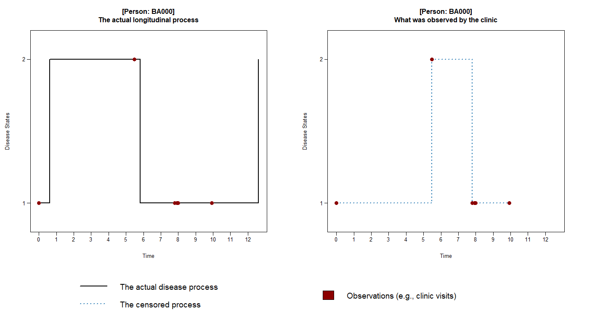

# The 'LCTMC.simulate' package

  <!-- badges: start -->
  [](https://github.com/j-kuo/LCTMC.simulate/actions/workflows/R-CMD-check.yaml)
  <!-- badges: end -->

This R package provides an intuitive and simple to use interface to simulate data from a **L**atent class **C**ontinuous-**T**ime **M**arkov **C**hain model. For developers, the source code can be modified with ease to extend the funtionalities for more general cases. 

## Overview

The CTMC has been studied for more than half a decade as of 2022. It has found many use cases in epidemiological studies, clinical trials, and public health surveillance. It is a useful tool to study the dynamic of a multi-state process. It can also be extended in several directions. For example, the [msm](https://cran.r-project.org/web/packages/msm/vignettes/msm-manual.pdf) package uses the CTMC in a hidden Markov model (HMM), or [semi-Markov models](https://www.sciencedirect.com/topics/computer-science/semi-markov-process) where the distribution assumption on sojourn times are relaxed.

In our work, we extended the CTMC model by assuming individuals belong to one of $K$ latent clusters/classes where each cluster is characterized by the differences in the dynamic of the multi-state process (i.e., the rate or _speed_ of transitions).

## Installation

```R
# use the 'devtools' package to directly install from GitHub
devtools::install_github("j-kuo/LCTMC.simulate")
```

Note that 'LCTMC.simulate' was built under **R version 4.2.1**, though it is likely to work with older versions of R too.

## Usage
Here is an example to demonstrate the simulation of a binary-state process:

```R
# set seed
set.seed(456)

# simulate
d = LCTMC.simulate::simulate_LCTMC(
  N.indiv = 5,
  N.obs_times = 5,
  max.obs_times = 9,
  fix.obs_times = FALSE,
  true_param = LCTMC.simulate::gen_true_param(K_class = 3, M_state = 2),
  alpha.include = TRUE,
  beta.include = TRUE,
  K = 3, M = 2,
  p1 = 2, p2 = 2,
  initS_p = c(0.5, 0.5),
  death = NULL
)

# convert to data frames
my_df = LCTMC.simulate::convert_sim_data_2df(my_list = d$sim_data, type = "both")
```

Here we've simulated a binary-state process with `K = 3` latent clusters. Using the `N.indiv = 5` argument to generate 5 independent CTMC processes (one per person). Each person is observed `N.obs_times = 5` times at random between the time interval [0, 9] (determined by `max.obs_times`).

## Visualizing CTMC
To visualize the CTMC process, here we plot one person's (ID# EA000) binary-state process over time, 

```R
# plot
LCTMC.simulate::plot_transitions(df = my_df, id = "EA000")
```



The figure on the left shows the _underlying_ process from time = 0 to 9.5

> To summarize,  
> 1. This person begins by being in state **1** at time = 0
> 2. The state then transitions to state **2** at approx. time = 1.5
> 3. At approx. time = 3.75, the state transitions back to state **1**
> 4. Very quickly, the state then jumps back to state **2**, at around time = 4.25
> 5. Similar interpretation can be applied to the transitions at time = 8.25 and 9.5.

The red dots in the figures indicate the the times at which data are being collected on this person (e.g., at a doctor's visit). If we do not consider the possibility of interval censoring then the the binary-state process would look like the figure on the right.

In time-to-event analyses, however, making this assumption will likely lead to biased estimates. As any transitions that occur between observations are not being accounted for. The CTMC model or other Markov-based models handle these unobserved in-between-observation changes by making some assumptions on the sojourn time ([what is sojourn time](https://www.sciencedirect.com/topics/engineering/sojourn-time)).

</br>

## More Info

### Authors
* **Jacky Kuo** - _author_, _maintainer_
* **Wenyaw Chan**, PhD - _advisor_

### Wiki
* [Latent Class Modelling](https://en.wikipedia.org/wiki/Latent_class_model)
* [Continuous-Time Markov Chain](https://en.wikipedia.org/wiki/Continuous-time_Markov_chain)